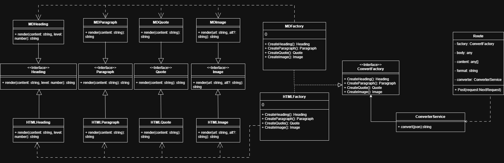

# Project Architecture

## Abstract Factory Pattern

The following diagram illustrates the implementation of the Abstract Factory pattern used in this project:

### Main Components:
- **AbstractFactory**: Base interface for factories
- **ConcreteFactory**: Specific factory implementations
- **AbstractProduct**: Product interfaces
- **ConcreteProduct**: Concrete product implementations